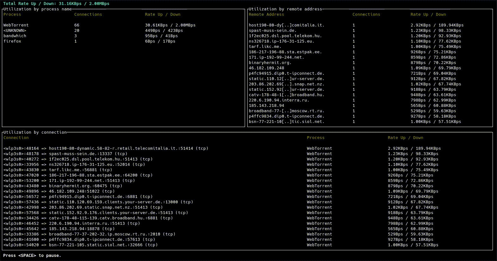

## bandwhich



This is a CLI utility for displaying current network utilization by process, connection and remote IP/hostname

### How does it work?
`bandwhich` sniffs a given network interface and records IP packet size, cross referencing it with the `/proc` filesystem on linux or `lsof` on MacOS. It is responsive to the terminal window size, displaying less info if there is no room for it. It will also attempt to resolve ips to their host name in the background using reverse DNS on a best effort basis.

### Installation

#### Arch Linux

```
yay -S bandwhich
```

#### MacOS and other Linux flavours

```
cargo install bandwhich
```

If you're on linux, you could also get the generic binary from the releases.

Windows is not supported at the moment - if you'd like to contribute a windows port, it would be very much welcome.

### Usage
```
USAGE:
    bandwhich [FLAGS] [OPTIONS]

FLAGS:
    -h, --help          Prints help information
    -n, --no-resolve    Do not attempt to resolve IPs to their hostnames
    -r, --raw           Machine friendlier output
    -V, --version       Prints version information

OPTIONS:
    -i, --interface <interface>    The network interface to listen on, eg. eth0
```

Note that since `bandwhich` sniffs network packets, it requires root privileges - so you might want to use it with (for example) `sudo`.

### raw_mode
`bandwhich` also supports an easier-to-parse mode that can be piped or redirected to a file. For example, try:
```
bandwhich --raw | grep firefox
```
### Contributing
Contributions of any kind are very welcome. If you'd like a new feature (or found a bug), please open an issue or a PR.

To set up your development environment:
1. Clone the project
2. `cargo run`, or if you prefer `cargo run -- -i <network interface name>` (you can often find out the name with `ifconfig` or `iwconfig`). You might need root privileges to run this application, so be sure to use (for example) sudo.
    
To run tests: `cargo test`

Note that at the moment the tests do not test the os layer (anything in the `os` folder).

If you are stuck, unsure about how to approach an issue or would like some guidance, you are welcome to contact: aram@poor.dev

### License
MIT
